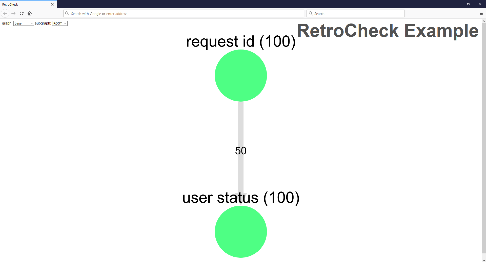
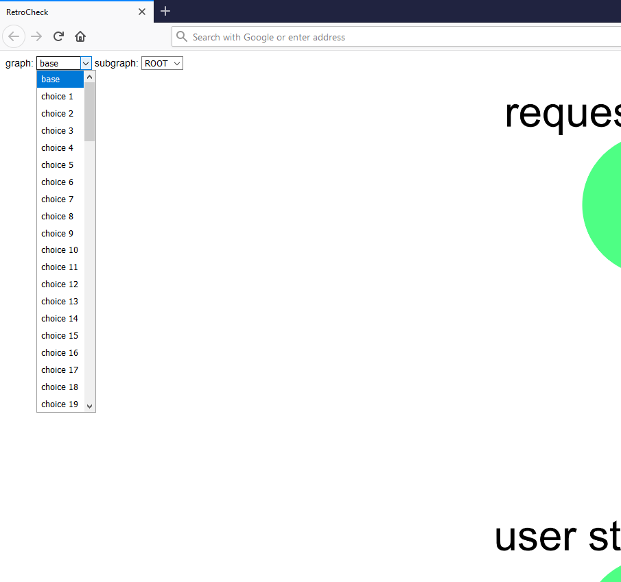
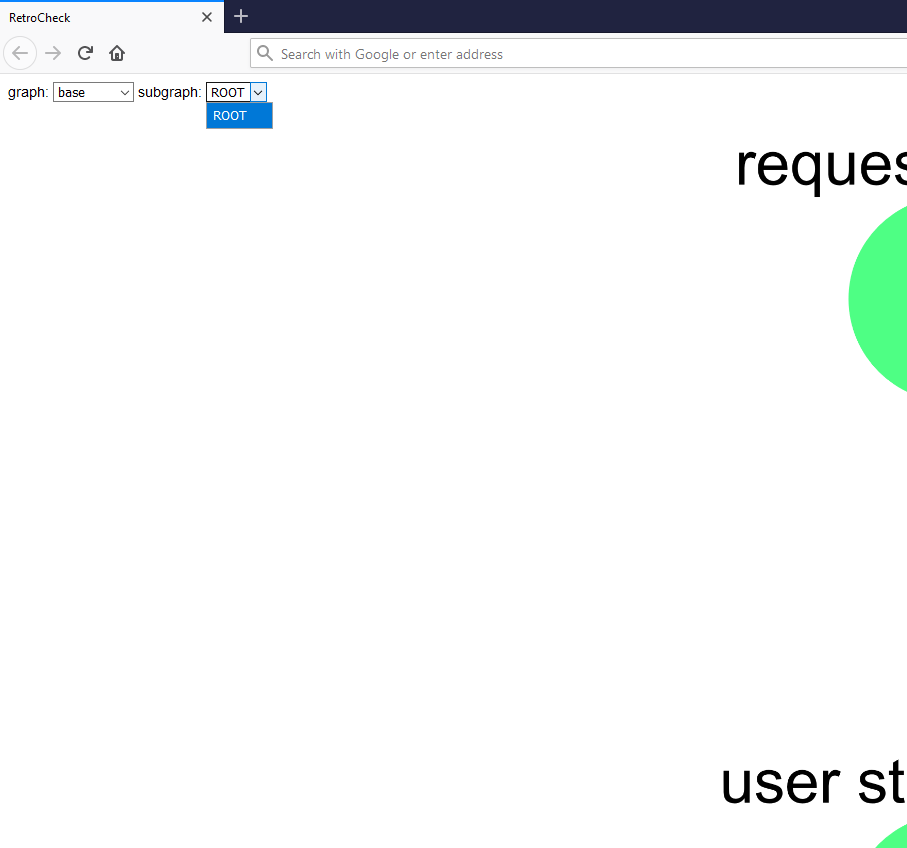
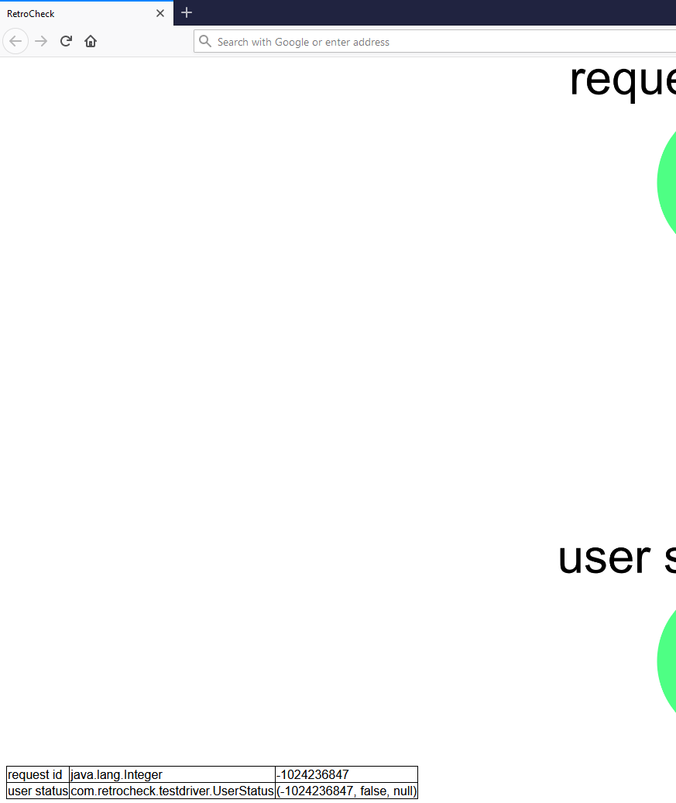

# Example

As an example of RetroCheck's style of testing, we'll do a test of a small Spring Boot application called UserStatusService.

1. [Running the Example System](#Running-the-Example-System)  
1. [Overview of the Test App](#Overview-of-example-testapp)  
1. [Test App Details](#example-testapp-details)  
    a. [MonitorWith](#monitorwith)  
    b. [Assertions](#assertions)  
    c. [Mocks](#mocks)  
    d. [Configuration](#configuration)
1. [Overview of the Test Driver](#Overview-of-example-testdriver)  
1. [Test Driver Details](#example-testdriver-details)  
    a. [Redis](#redis)  
    b. [Generators](#generators)  
    c. [Nodes](#nodes)  
    d. [Edges](#edges)  
    e. [DataLoaders](#dataloaders)  
    f. [Graphs](#graphs)  
    g. [Testers](#testers)  
    h. [Visualization](#visualization)

## Running the Example System

Requirements:
- Docker
- Docker Compose
- JRE 1.8

From `/example`, run `docker-compose up -d`.  This starts the memcached and Redis containers that the example system depends on.  Then start `example-app` by running `./gradlew bootRun` (or in an IDE), and run the test in `example-testdriver` by running `./gradlew test` (or in an IDE).

The example uses the `retrocheck.convenience` library, so this document is written under the assumption that you're using that library.

## Overview of `example-app`

On `/userstatus`, UserStatusService serves requests for a user's status -- whether or not a user is logged in.  UserStatusService does this by querying memcached with the user's ID.

We'll write a RetroCheck assertion for `/userstatus`.  It only requires two changes to the code under test (not including the assertion code itself).  The first change is an annotation that we add to the method we want to test, and the second change is a method call that configures the application to use RetroCheck.

Here is a snippet from `example-app/build.gradle`, showing what's required in order to use RetroCheck in `example-app`:

```groovy
plugins {
	...

	// This plugin is required in order to use RetroCheck assertions and mocks.
	id 'io.freefair.aspectj.post-compile-weaving' version '4.1.6'
}

...

repositories {
	...

	// RetroCheck is hosted on JitPack.
	maven { url 'https://jitpack.io' }
}

...

dependencies {
	// This references all four of the RetroCheck libraries.
	implementation 'com.github.tomakita:RetroCheck:0.1.12'
	// This loads the aspect code in the retrocheck.assertion library.
	aspect 'com.github.tomakita.RetroCheck:assertion:0.1.12'
	// This loads the aspect code in the retrocheck.mock library.
	aspect 'com.github.tomakita.RetroCheck:mock:0.1.12'

	// This library is a dependency of the retrocheck.convenience library.
	compile group: 'org.redisson', name: 'redisson', version: '3.12.0'

	...
}
```

Here is the controller that implements `/userstatus`:

UserStatusService/UserStatusController.java:
```java
@RestController
public class UserStatusController {

    private MemcachedClient memcached;
    private MetricsClient metricsClient = new MetricsClient();

    public UserStatusController(@Autowired MemcachedClient memcached) {
        this.memcached = memcached;
    }

    @RequestMapping("/userstatus")
    // The MonitorWith annotation tells RetroCheck where to find the assertion for
    // the userStatus method.
    @MonitorWith(UserStatusControllerAssertions.class)
    public UserStatus userStatus(@RequestParam(value="userId") Integer userId)
            throws InterruptedException, MemcachedException, TimeoutException {

        System.out.println("Serving request for user id = " + userId);

        // Due to mocking, this is actually a call to MockMetricsClient.emit.
		// If this is your first read of this document, feel free to ignore this.
        metricsClient.emit();

        return findUserStatus(userId);
    }

    // This method queries for the status of a user, by keying into
    // memcached with the user's ID.  If the user isn't found in memcached,
    // this method returns null.  Otherwise, it returns the user's status
    // wrapped in a UserStatus object.
    private UserStatus findUserStatus(Integer userId)
            throws InterruptedException, MemcachedException, TimeoutException {

        Boolean isLoggedIn  = memcached.get(userId.toString());
        if (isLoggedIn != null) {
            return new UserStatus(userId, isLoggedIn, Instant.now());
        } else {
            return null;
        }
    }
}
```

Here is the assertion that checks to make sure `/userstatus` is working correctly:

UserStatusService/UserStatusControllerAssertions.java:
```java
@Component
public class UserStatusControllerAssertions {

    private MemcachedClient memcached;

    public UserStatusControllerAssertions(@Autowired MemcachedClient memcached) {
        // You can use objects from Spring's IoC container in assertion code.
        this.memcached = memcached;
    }

    // This is an assertion for the UserStatusController.userStatus method.
    // It returns a boolean, and has access to UserStatusController.userStatus's
    // argument list, as well as the value it returned, and the UserStatusController
    // instance on which it was invoked.
    // Assertions are invoked by RetroCheck as the system under test runs, and their
    // return values are sent to Redis for use by test running code.
    public boolean userStatus(Integer userId,
                              UserStatus result,
                              UserStatusController instance)
            throws InterruptedException, MemcachedException, TimeoutException {

        System.out.println("Running assertion for user id = " + userId);

        // We check to see if the user has a status in memcached.  If it does,
        // we make sure that status matches what is being returned by /userstatus.
        // Otherwise, we make sure that /userstatus is returning null.
        Boolean isLoggedIn  = memcached.get(userId.toString());
        if (isLoggedIn != null) {
            return result.isLoggedIn() == isLoggedIn;
        } else {
            return result == null;
        }
    }
}
```

Here is the `MetricsClient` implementation.  We'd like to mock the call to `MetricsClient.emit`.  If this is your first read of this document, feel free to ignore this:

```java
public class MetricsClient {
    // The MockWith annotation tells RetroCheck where to find the mock for this method.
    @MockWith(MetricsClientMock.class)
    public void emit() {
        // Imagine that there's code here that we don't want to execute during our tests.
    }
}
```

Here is the mock implementation of `MetricsClient`.  If this is your first read of this document, feel free to ignore this:

```java
public class MetricsClientMock {
    public void emit() {
        System.out.println("Mock MetricsClient invocation.");
    }
}
```

And here is the code that configures the application to use RetroCheck (the code in this file also configures memcached -- it's just a convenient place to put the RetroCheck configuration code, since it runs on startup):

UserStatusService/MemcachedConfig.java:
```java
@Configuration
public class MemcachedConfig {

    public MemcachedConfig(@Autowired ApplicationContext context) {

        // This configures RetroCheck to emit metadata to Redis as assertions
        // succeed and fail.  This metadata will be used by our test driver,
        // which will also be connected to Redis.
        ResultEmitter.connect(
                "redis://localhost:6379", // Address of Redis.
                false,
                context::getBean); // Service locator method.
    }

    ...
}
```

## `example-testapp` Details

### MonitorWith

When placed on a method `m`, the `@MonitorWith(A.class)` annotation associates `m` with an assertion method `a`.  In order for RetroCheck to perform this association, the following rules must be satisfied:

* `a` must be defined in class `A`
* `a` must have the same name as `m`
* `a` must not be overloaded
* given the following signature for `m`: `any-access-modifier R m(T t, U u)`, and assuming that `m` is defined on class `M`, `a` must have one of the following signatures:
	* `public boolean a(T t, U u, R r)`
	* `public boolean a(T t, U u, R r, M m)`
	* `public boolean a(T t, U u, R r, Exception ex)`
	* `public boolean a(T t, U u, R r, M m, Exception ex)`
	* `public boolean a(T t, U u, R r, Exception ex, M m)`
	* `public com.retrocheck.assertion.AssertionResult a(T t, U u, R r)`
	* `public com.retrocheck.assertion.AssertionResult a(T t, U u, R r, M m)`
	* `public com.retrocheck.assertion.AssertionResult a(T t, U u, R r, Exception ex)`
	* `public com.retrocheck.assertion.AssertionResult a(T t, U u, R r, M m, Exception ex)`
	* `public com.retrocheck.assertion.AssertionResult a(T t, U u, R r, Exception ex, M m)`

Note: if `R` is `void`, then omit `R r` from each of the signatures, above.

Note: the signature variants with `Exception ex` are meant to allow assertions to check that an exception has been thrown.  The value supplied for this parameter will be `null` if no exception has been thrown.

### Assertions

As mentioned in the section above, assertions can return either `boolean` or `AssertionResult`.  For more information about the usage of `AssertionResult`, see [Testers](#Testers).

### Mocks

RetroCheck is meant to be used with real network dependencies (e.g. real databases, real message queues, etc).  However, in order to make certain kinds of testing easier, RetroCheck allows you to mock certain kinds of method calls.  This is done using the `@MockWith` annotation, which works in the same way that `@MonitorWith` does.  There are only two differences to be aware of:

* `@MockWith` *replaces* a method call with a mock method call, whereas `@MonitorWith` *adds* an assertion method call after the specified method call.
* If we want to mock a method `m` with signature `any-access-modifier R m(T t, U u)`, then our mock method `m'` may have only one signature: `public R m'(T t, U u)`

If the return value of a mock method must depend on some other entity in the data model, i.e. if the mock itself represents an entity, then the mock entity can simply be added to the data model (i.e. added to the graph representing the data model), and its value can be loaded into Redis as a key-value pair.  See [Overview of the Test Driver](#Overview-of-example-testdriver) for information on how to do that.

Mocks currently have a limitation that they can only replace code that you own, since it isn't possible to place the `@MockWith` annotation on code that you don't own.  This is unfortunate, since you'll often want to mock code that you don't own.  I'm working on a way of addressing this problem right now, and I'm hoping that this won't be a limitation for long.

### Configuration

In this example, RetroCheck is configured using the `ResultEmitter.connect` method, which is defined in the `retrocheck.convenience` library, and is meant to be an easy way of configuring RetroCheck with settings that most people will find useful.  This method connects RetroCheck to Redis (which requires that a Redis instance is available), and configures RetroCheck to emit messages to Redis pub-sub channels when assertions succeed and fail.

For a more granular way of configuring RetroCheck, use the `retrocheck.assertion.Actions` class:

```java
public class Actions {
	// Turns assertions on or off.
    public static boolean areAssertionsEnabled = true;
	// Do test{Success,Failure} events fire?  false for yes, true for no.
    private static boolean monitorOnlyMode = false;
	// Do monitor{Success,Failure} events fire?  false for yes, true for no.
    private static boolean testOnlyMode = false;
	// Do {test,monitor}Success events fire?  false for yes, true for no.
    private static boolean failureOnlyMode = true;

	// Event that fires when an assertion succeeds.
    private static AssertionEvent testSuccessEvent = new AssertionEvent();
	// Event that fires when an assertion succeeds.
    private static AssertionEvent monitorSuccessEvent = new AssertionEvent();
	// Event that fires when an assertion fails.
    private static AssertionEvent testFailureEvent = new AssertionEvent();
	// Event that fires when an assertion fails.
    private static AssertionEvent monitorFailureEvent = new AssertionEvent();
	// Event that fires when an assertion throws an exception.
    private static AssertionExceptionEvent assertionExceptionEvent = new AssertionExceptionEvent();
	// Event that fires when the aspect code throws an exception.
    private static GeneralExceptionEvent generalExceptionEvent = new GeneralExceptionEvent();

	// A lambda that tells RetroCheck how to create new instances of a particular class.
	// By default (if no serviceLocator is supplied), this happens by reflection.  
	// Note: reflective creation of objects happens only once, as the result is memoized 
	// for future use.  Thus, using reflection here isn't a significant performance hit.
    private static Function<Class, Object> serviceLocator = schema -> {
        try {
            return schema.newInstance();
        } catch (InstantiationException | IllegalAccessException e) {
            throw new RuntimeException(e);
        }
    };

	...
}
```

All of the private fields shown here have public accessors.  Note that the distinction between "monitor" and "test" events is arbitrary -- they are just two separate sets of events that can be used for pretty much anything.  The idea is that RetroCheck can be used for monitoring (i.e. in prod), where the action taken on assertion success/failure would be e.g. logging, or for testing, where the action taken on assertion success/failure would be e.g. emission of a Redis message.

For mocking, there is also a `retrocheck.mock.Actions` class:

```java
public class Actions {
	// Turns mocks on or off.
    public static boolean areMocksEnabled = true;

	// Service location lambda -- works in the same way as the assertion service locator.
    private static Function<Class, Object> serviceLocator = schema -> {
        try {
            return schema.newInstance();
        } catch (InstantiationException | IllegalAccessException e) {
            throw new RuntimeException(e);
        }
    };
}
```

## Overview of `example-testdriver`

Here is the test driver code that invokes the `/userstatus` end point in UserStatusService, which will invoke its assertion code, as well.  When the assertion we've written in UserStatusService succeeds or fails, messages will be put onto Redis pub-sub channels, and our test driver will be notified.  This test driver code runs as a junit test.

Here is a snippet from `example-testdriver/build.gradle`, showing what's required in order to use RetroCheck in `example-testdriver`:

```groovy
...

repositories {
	...

	// RetroCheck is hosted on JitPack.
	maven { url 'https://jitpack.io' }
}

...

dependencies {
	// This references all four of the RetroCheck libraries.
	implementation 'com.github.tomakita:RetroCheck:0.1.12'

	// These libraries are dependencies of the convenience library.
	compile group: 'com.pholser', name: 'junit-quickcheck-generators', version: '0.9'
	compile group: 'com.googlecode.xmemcached', name: 'xmemcached', version: '2.4.6'
	implementation 'org.springframework.boot:spring-boot-starter-web'
	compile group: 'org.redisson', name: 'redisson', version: '3.12.0'
	compile group: 'org.awaitility', name: 'awaitility', version: '4.0.2'
	compile group: 'com.fasterxml.jackson.core', name: 'jackson-databind', version: '2.10.2'
	compile group: 'com.pholser', name: 'junit-quickcheck-core', version: '0.9.1'
}

...
```

TestDriver/UserStatusServiceTests.java:
```java
@SpringBootTest
class UserStatusServiceTests {

	// Redis allows RetroCheck to know when assertions in the system under test have failed,
	// and when tests have ended.
	private Redis redis = new Redis("redis://localhost:6379");

	// This is a dependency of the system under test.  It's where the status (logged in
	// or not) of users is stored.
	private MemcachedClient memcached = new XMemcachedClient("localhost",11211);
	// This is also a dependency of the system under test.  It's an object that's used to
	// send HTTP requests to the UserStatusService.
	private TestAppClient testAppClient = new TestAppClient();

	UserStatusServiceTests() throws IOException {}

	@Test
	void test() {

		// We use Generators to generate (pseudorandomly) instances of various types.
		// DefaultGenerator has generators for primitive types, and others can be added
		// by using the ".with()" method.
		DefaultGenerator generator =
				new DefaultGenerator()
						.with(
								UserStatus.class,
								(random, status) -> new UserStatus(random.nextInt(), random.nextBoolean()));

		// Each entity in the system is represented by a Node.
		Node<Integer> requestId =
				new Node<>(
						"request id", // Used to identify each entity.
						Integer.class, // The type of each entity -- required due to type erasure.
						generator, // This is how the Node type knows how to generator Integer instances.
						"http", // Tells the DataLoader how to load instances of this entity.
						true, // Is this entity used to invoke the system?
						true); // Can we skip deletion of this entity at the end of each test?
		Node<UserStatus> userStatus =
				new Node<>(
						"user status",
						UserStatus.class,
						generator,
						"memcached");

		List<Node<?>> nodes = Arrays.asList(requestId,	userStatus);

		List<Edge<?, ?>> edges =
					Arrays.asList(
							new Edge<>(
									// This edge goes from the requestId node...
									requestId,
									// ...to the userStatus node.
									userStatus,
									// A constraint that's placed on our two nodes:
									// v (userStatus) must have the same Id as u (requestId).
									(u, v) -> v.withId(u),
									// The probability with which the above constraint is satisfied.
									new Probability(50)));

		Map<String, Function<?, ?>> loader = new HashMap<>();

		// This tells the DataLoader how to load UserStatus entities into memcached.
		loader.put("memcached", (UserStatus entity) -> {
			try {
				return memcached.set(entity.getUserId().toString(), 60, entity.isLoggedIn());
			} catch (TimeoutException | InterruptedException | MemcachedException e) {
				throw new RuntimeException(e);
			}
		});

		// This tells the DataLoader how to execute HTTP requests.
		loader.put("http", (Integer entity) -> testAppClient.get(entity));

		// This tells the DataLoader how to unload UserStatus entities from memcached
		// at the end of each test.
		Map<String, Function<?, ?>> unloader = new HashMap<>();
		unloader.put("memcached", (UserStatus entity) -> {
			try {
				return memcached.delete(entity.getUserId().toString());
			} catch (TimeoutException | InterruptedException | MemcachedException e) {
				throw new RuntimeException(e);
			}
		});

		DefaultDataLoader dataLoader = new DefaultDataLoader(loader, unloader, redis);

		// This object orchestrates the entire test.  Note that its preprocess, process, and postprocess
		// methods must all be called, and in that order.  Preprocess and postprocess should be called
		// once per test, whereas process may be called an arbitrary number of times per test.		
		DefaultTester tester = new DefaultTester("RetroCheck Example");
		DefaultGraph graph = new DefaultGraph().withNodes(nodes).withEdges(edges);
		tester.preprocess(graph);

		// You can call this method in a loop, because each time it's called, it will generate
		// a new data model, load it into the system under test (using DataLoader), invoke the
		// system under test (using Nodes marked as entry points), wait for the test to end (using
		// Redis), and unload the data model from the system under test.
		for (int i = 0; i < 99; i++) {
			System.out.println("Test iteration: " + i);
			
			TestResult result =
					tester.process(
							dataLoader::orchestrate, // A lambda defining how data is loaded into and unloaded
							// from the system under test.
							new Outcome("userStatus")); // This Outcome object tells DefaultTester
							// the name of the assertion which indicates the end of a test.

			// DefaultTester.process returns a TestResult object, which contains a list of assertions
			// which failed during the test (if any), and the seed used to generate data during the test.
			if (result.hasFailures()) {
				System.out.println("Test failed with seed: " + result.getSeed());
			}
		}

		// This generates visualization files, for use in understanding and debugging your data model and various instances of it.
		tester.postprocess();
		// This disposes of the test driver's connection to Redis.
		dataLoader.destroy();
	}
}
```

## `example-testdriver` Details

### Redis

Redis is used by `retrocheck.convenience` for assertion eventing.  It can also be used for key-value storage, if that's something that you want to use during testing, e.g. as a backing data store for mocks.  If you don't want to use `retrocheck.convenience`, then Redis isn't a dependency.

### Generators

In this example, we use `retrocheck.convenience.DefaultGenerator` to generate entity instances.  This class implements the `retrocheck.convenience.Generator` interface, which is what you'll want to implement if you want to make your own generator class.  Out of the box, `DefaultGenerator` can generate values for Java primitives (`int`, `boolean`, etc), and support for more types can be added via the `DefaultGenerator.with` method (calls to this method can be chained, e.g. `generator.with(...).with(...)`).

In some situations, you'll want to ensure that the values generated for some type are unique.  To support this, `DefaultGenerator` has a `withUnique` method:

```java
new DefaultGenerator()
	.withUnique(
		Boolean.class, 
		(r, status, unique) -> unique.compute(
			"uniqueBoolean", // A unique generator is identified by this value, along with its type (Boolean, here).
			() -> r.nextBoolean())); // A lambda specifying how this kind of value should be generated.
```

For various reasons, you might want to use multiple instances of `DefaultGenerator`.  This is supported -- RetroCheck will unify all `DefaultGenerator` instances as the nodes they've been assigned to are processed by the `Graph` that they're part of.  This means that a single seed is used by all `DefaultGenerators` at runtime, which makes reproducibility of test failures easier.

### Nodes

The `Node<T>` constructor has other overloads.  Here's the one that allows all of its fields to be set:

```java
public Node(
	String name, // The name of the node -- used for visualization.  Required.
	Class<T> entitySchema, // The type of the node.  Required.
	Function<T, T> refinement, // A lambda that defines a transformation on the value 
	// generated (by the Generator passed in, below) for this node.  Optional -- defaults to the identity function.
	Generator generator, // A Generator that generates values for the type of this node.  Required.
	String dataLoaderName, // The name of the DataLoader that should load this node into the system under test.  Required.
	boolean isEntryPoint, // Is this node one of the entry points of the system under test?  Optional -- defaults to false.
	Probability probability, // The probability with which this node should be included
	// in our data model.  Optional -- defaults to Probability.ALWAYS a/k/a new Probability(100), so the node
	// will be included with 100% probability.
	boolean isTransient) // Can we skip deletion of this node's entity at the end of each test run?
	// Optional -- defaults to false.
```

### Edges

For each edge, we specify a probability with which that edge is traversed, i.e. a probability with which the constraint represented by the edge is satisfied in our data model.  But what if we want to specify a *set* of edges, and only choose one edge from the set (i.e. choose from a set of edges in a mutually exclusive way)?  RetroCheck supports this by allowing you to tag each edge with a `setId`.  Edges with the same `setId` form a set *E* of mutually exclusive edges, and the sum *s* of the probabilities of all edges in *E* must satisfy 0 <= *s* <= 100.

In addition to the constructor shown in this example, the `Edge<U, V>` type has other constructors.  Here's the one that allows all of its fields to be set:

```java
public Edge(
	Node<U> u, // An edge from u...  Required.
	Node<V> v, // ...to v.  Required.
	BiFunction<U, V, V> refinement, // The constraint represented by the edge.  Required.
	Probability probability, // The probability with which the edge is expressed in the 
	// data model.  Optional -- defaults to Probability.ALWAYS.
	String setId) // The set of which this edge is a member.  Optional -- defaults to a 
	// value which indicates that the edge is not part of any set.
```

### DataLoaders

A `DataLoader` (implemented by `DefaultDataLoader` in the example) is how RetroCheck orchestrates the un/loading of data into and out of the system under test.  The `loader` map loads each generated entity, and the `unloader` map unloads each generated entity.  In some cases, though, this won't be enough.  For example, if the system under test generates and persists its own data during a test run, it may be necessary to make sure that data is deleted, too.  To support this, `DefaultDataLoader` uses a `truncater` (specified as a map, just like `loader` and `unloader`), which specifies lambdas for doing ad-hoc cleanup, e.g. truncating a database table.

### Graphs

A `Graph` (implemented by `DefaultGraph` in the example) represents the data model of the system under test.  From a graph, RetroCheck generates instances of entities, and loads them into the system under test.  RetroCheck treats graphs as directed graphs, and each graph must be acyclic.

In RetroCheck, graphs are made of nodes and edges (as shown in the example), but they can also be made of `Subgraph` instances:

```java
Node<Integer> a = new Node<>("a", Integer.class, generator, null, true);
Node<Integer> b = new Node<>("b", Integer.class, generator, null, true);
Subgraph subgraph = new Subgraph(false).withName("test subgraph").withNodes(Arrays.asList(a, b));
DefaultGraph graph = new DefaultGraph().withSubgraphs(Arrays.asList(subgraph));
```

Subgraphs allow you to abstract various parts of a graph, in order to make it easier to reason about.  Subgraphs also allow you to reuse parts of graphs in multiple tests.  To further support reuse, RetroCheck has a `SubgraphArchetype` class, which allows you to make copies of subgraphs.  You might want to do this if, for example, you wanted to create multiple copies of a subgraph, but with different node names in each copy:

```java
SubgraphArchetype archetype = new SubgraphArchetype(nodes,  edges);
Subgraph subgraphCopy = archetype.induce("greatNodeNamePrefix");
```

With each graph, RetroCheck associates a seed.  This seed is of type `long`, and it's used to seed the source of randomness that RetroCheck uses to generate entity instances.  If you want to re-run a test and ensure that the exact same sequence of entity instances are generated by RetroCheck, then you can manually set the seed value on a graph:

```java
long arbitrarySeed = 895;
Graph graph = new DefaultGraph().withNodes(nodes).reSeed(arbitrarySeed);
```

### Testers

A `Tester` (implemented by `DefaultTester` in this example) is used to orchestrate a RetroCheck test.  This entails:

1. Loading data into data stores.
2. Invoking the system under test.
3. Listening for the end of each test.
4. Unloading data from data stores, as well as data truncation.
5. Reporting the results of a test.

There are multiple ways in which a `Tester` can listen for the end of each test:

* Via the `Outcome` instance passed to `Tester.process`.  In this case, the `Tester` will listen (via Redis) for the completion of an assertion method with this name (unfortunately, fully-qualified method names aren't supported, yet), and will end the test when it knows the specified assertion method has completed.  By default, `DefaultTester` will wait 60 seconds for a test to complete, and will then time out.  This timeout can be configured using `DefaultDataLoader.setTimeoutMillis`.
* Via a `retrocheck.assertion.AssertionResult` returned by assertion methods.
* Via a combination of the two ways outlined above.

All assertion methods can return either `boolean` or `retrocheck.assertion.AssertionResult`.  `retrocheck.assertion.AssertionResult` is a class that contains information about the result of an assertion:

```java
public AssertionResult(
	boolean isSuccess, // Was the assertion successful?
	String continuation, // The name of the assertion method that indicates the end of
	// the current test.  This will be returned to the Tester, and listened for accordingly.
	// If an assertion method supplies its own name for this value, then the Tester will
	// listen for the *next* invocation of this assertion method.  This is a way of supporting recursive systems.
	boolean isExecutionComplete) // Should the test end right now, ignoring all previous continuation/outcome names?
```

If you don't want `DefaultTester` to wait for a particular outcome, you can do that with `Outcome.completeImmediately`, which can be specified in `Outcome`'s constructor:

```java
// If you want each test case to end immediately, pass `true` for completeImmediately.
public Outcome(String name, boolean completeImmediately)
```

### Visualization

When it runs, RetroCheck emits an HTML visualization of your data model (via `DefaultTester.postprocess`), and all generated instances of it.  The files (`graph_visualization.html/js/css`) containing this visualization are written to the location of your test driving application -- in the case of `example-testdriver`, this is the root directory of the project.  If you open the generated `graph_visualization.html` with a web browser, here's what you see, in the case of `example-testdriver`:



The visualization shows each node and edge in the graph representing your data model.  Each node and edge is accompanied by the probability with which it's included in the data model.

There are two dropdowns in the top-left corner of the page:



The left-most dropdown contains a list of graphs to view.  The first graph (labeled "base") is unchanged from the set of nodes and edges that you specified in the `Graph` instance on which you run each test.  The remaining graphs in the dropdown (labeled "choice n") are instances of the base graph that RetroCheck has created, by generating entity values for each node, and also by choosing whether to include each node and edge.  Nodes and edges which have been omitted from the graph won't be visible, here.



The right-most dropdown contains a list of subgraphs of the currently chosen graph, so you can view them in isolation.  This graph has no subgraphs, so all of its nodes and edges are in the "ROOT" subgraph.

In the bottom-left corner of the page, there's a table in which the generated values of each entity are displayed:



This table is not visible for the "base" graph.